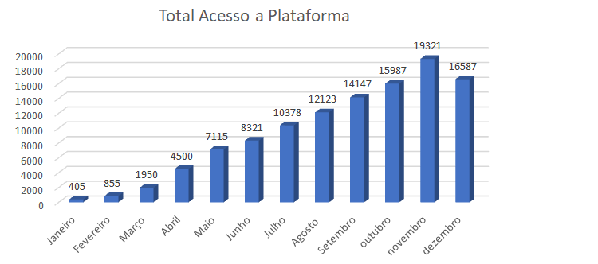
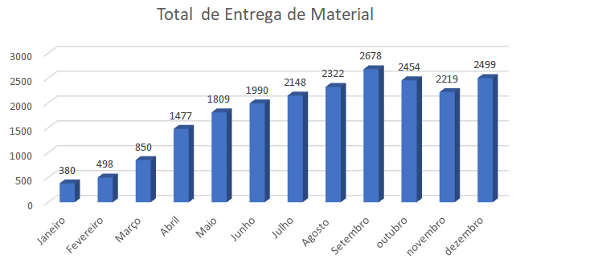
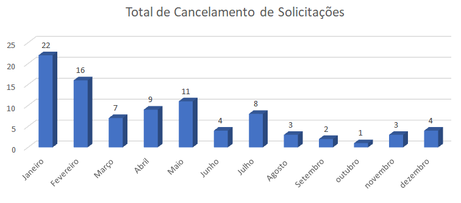
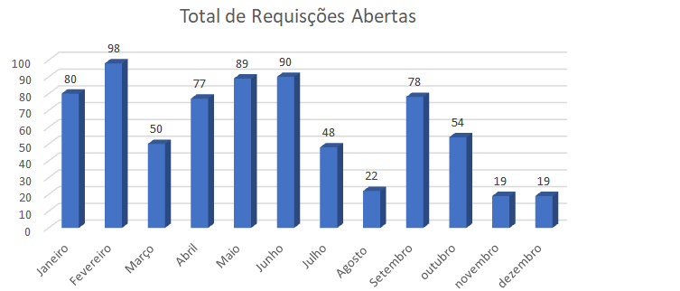
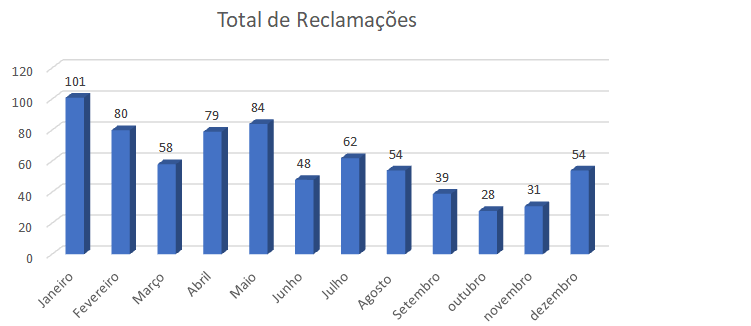
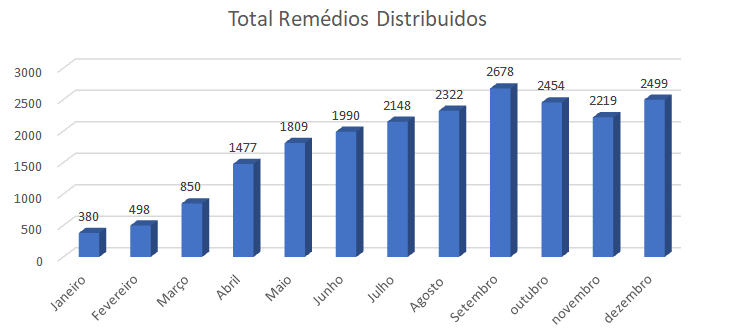

# Especificações do Projeto

A escolha do referido problema foi definida por meio de discussões e estudos realizados pelos membros da equipe. Os detalhes levantados nesse processo foram consolidados na forma de personas e histórias de usuários.

## Personas

A definição do problema foi consolidada com a participação dos usuários por meio de entrevistas, elaborando a criação das pessoas e histórias de usuários.

## Histórias de Usuários

A partir de uma entrevista com as pessoas, foi possível registrar as seguintes histórias de usuários:

|EU COMO... `PERSONA`| QUERO/PRECISO ... `FUNCIONALIDADE` |PARA ... `MOTIVO/VALOR`       |
|--------------------|------------------------------------|------------------------------|
|  Maurício José Pimentel | Solicitar o medicamento sem precisar ir ao local. | Para não precisar pegar fila e ficar muito tempo em pé. |
|  Júlia Gabriella Campos | Saber a lista de medicamentos solicitados no momento. | Para verificar a disponibilidade do medicamento das farmácias em que trabalha.|
| Ana Angélica Medeiros | Visualizar o status do processo de solicitação. | Para que me ajude na organização, evitando a falta de medicamentos nas farmácias populares. |
|  Débora Beatriz Souza | Saber o motivo do cancelamento da sua solicitação. | Para conseguir resolver problemas futuros, caso isso se repita. |
|  Joaquim Luiz Ferreira | Facilidade de acesso e boa interatividade.| Para conseguir adquirir seus medicamentos mais rapidamente. |

## Modelagem do Processo de Negócio 

### Análise da Situação Atual

Apresente aqui os problemas existentes que viabilizam sua proposta. Apresente o modelo do sistema como ele funciona hoje. Caso sua proposta seja inovadora e não existam processos claramente definidos, apresente como as tarefas que o seu sistema pretende implementar são executadas atualmente, mesmo que não se utilize tecnologia computacional. 

### Descrição Geral da Proposta

Apresente aqui uma descrição da sua proposta abordando seus limites e suas ligações com as estratégias e objetivos do negócio. Apresente aqui as oportunidades de melhorias.

### Processo 1 – NOME DO PROCESSO

Apresente aqui o nome e as oportunidades de melhorias para o processo 1. Em seguida, apresente o modelo do processo 1, descrito no padrão BPMN. 

### Processo 2 – NOME DO PROCESSO

Apresente aqui o nome e as oportunidades de melhorias para o processo 2. Em seguida, apresente o modelo do processo 2, descrito no padrão BPMN.

## Indicadores de Desempenho

Com os indicadores de desempenho constituímos o conjunto de medidas da empresa, onde avaliamos a performance ao longo do tempo.
 

 

 

## Requisitos

As tabelas que se seguem apresentam os requisitos funcionais e não funcionais que detalham o escopo do projeto. Para determinar a prioridade de requisitos, aplicar uma técnica de priorização de requisitos e detalhar como a técnica foi aplicada.

### Requisitos Funcionais

|ID    | Descrição do Requisito  | Prioridade |
|------|-----------------------------------------|----|
|RF-001| O sistema deve dispor de um campo para cadastro do usuário, onde será registrado seu nome, data de nascimento, CPF e senha, e também da farmácia, onde será registrado nome do local, CNPJ e senha; | ALTA | 
|RF-002| O sistema deve permitir que o usuário realize o login utilizando seu CPF e senha, e que a farmácia realize o login utilizando seu CPNJ e senha cadastrados;| ALTA |
|RF-003| O sistema deve dispor de um campo para a solicitação de medicamentos, onde o usuário também poderá anexar suas guias e receitas; | ALTA | 
|RF-004| O sistema deve disponibilizar a função “status de solicitação”, onde a farmácia poderá informar ao cliente, de forma ágil, qual é o estágio da sua solicitação. As opções do “status de solicitação” serão as seguintes: “aprovado”, “Em processo”, “Recusado - motivo”, “Liberado para retirada” e, por fim, “pedido entregue”;| ALTA |
|RF-005| O sistema deve disponibilizar, ao lado do status, o motivo do cancelamento, caso a solicitação seja cancelada; | MÉDIA | 
|RF-006| O sistema deve permitir a alteração da senha;| MÉDIA |
|RF-007| O sistema deve permitir solicitações apenas no horário de funcionamento da farmácia, caso contrário, deve apresentar uma mensagem ao usuário, pedindo para que solicite no horário de funcionamento; | MÉDIA | 
|RF-008| O sistema deve dispor de uma central de ajuda;| BAIXA |
|RF-009| O sistema deve dispor de um campo para feedbacks, onde o cliente poderá avaliar e comentar sobre sua experiência com a farmácia. | BAIXA | 

### Requisitos não Funcionais

|ID     | Descrição do Requisito  |Prioridade |
|-------|-------------------------|----|
|RNF-001| O sistema deve ser responsivo, para rodar em um dispositivo móvel; | ALTA | 
|RNF-002| O sistema deve ser implementado com JavaScript e React-Native; |  ALTA | 
|RNF-003| A aplicação deve ser compatível com sistemas Android e iOS; | ALTA | 
|RNF-004| O aplicativo deve se restringir às tecnologias de desenvolvimento mobile. |  ALTA | 

## Restrições

O projeto está restrito pelos itens apresentados na tabela a seguir.

|ID| Restrição                                             |
|--|-------------------------------------------------------|
|01| A primeira etapa do projeto referente a análise e especificação do problema deverá ser entregue até o dia 04/09/2022; |
|02| A segunda etapa do projeto referente ao levantamento dos requisitos e funcionalidades do sistema, como também os planos de testes de funcionalidade/usabilidade deverá ser entregue até o dia 02/10/2022;|
|03| A terceira etapa do projeto referente a 1° parte do desenvolvimento da solução deverá ser entregue até o dia 30/10/2022;|
|04| A quarta etapa do projeto refere-se à 2° parte do desenvolvimento do plano de teste, das funcionalidades e da usabilidade da aplicação até o dia 27/11/2022; |
|05| A quinta etapa do projeto deverá ser entregue no final do semestre letivo, não podendo extrapolar a data de 07/12/2022. |

## Diagrama de Casos de Uso

O diagrama contempla as principais ligações entre os casos de uso e permite detalhar os Requisitos Funcionais identificados na etapa anterior.

# Matriz de Rastreabilidade

A matriz de rastreabilidade é uma ferramenta usada para facilitar a visualização dos relacionamento entre requisitos e outros artefatos ou objetos, permitindo a rastreabilidade entre os requisitos e os objetivos de negócio. 

A matriz deve contemplar todos os elementos relevantes que fazem parte do sistema, conforme a figura meramente ilustrativa apresentada a seguir.

# Gerenciamento de Projeto

De acordo com o PMBoK v6 as dez áreas que constituem os pilares para gerenciar projetos, e que caracterizam a multidisciplinaridade envolvida, são: Integração, Escopo, Cronograma (Tempo), Custos, Qualidade, Recursos, Comunicações, Riscos, Aquisições, Partes Interessadas. Para desenvolver projetos um profissional deve se preocupar em gerenciar todas essas dez áreas. Elas se complementam e se relacionam, de tal forma que não se deve apenas examinar uma área de forma estanque. É preciso considerar, por exemplo, que as áreas de Escopo, Cronograma e Custos estão muito relacionadas. Assim, se eu amplio o escopo de um projeto eu posso afetar seu cronograma e seus custos.

## Gerenciamento de Tempo

O gráfico de Gantt ou diagrama de Gantt é uma ferramenta visual utilizada para controlar e gerenciar o cronograma de atividades de um projeto. Com ele, é possível listar tudo que precisa ser feito para colocar o projeto em prática, dividir em atividades e estimar o tempo necessário para executá-las.

**PARA MELHOR VISUALIZAÇÃO, DAR ZOOM NA IMAGEM!**

 

## Gerenciamento de Equipe

O gerenciamento adequado de tarefas contribuirá para que o projeto alcance altos níveis de produtividade. Por isso, é fundamental que a gestão seja gerenciada de modo que as tarefas e pessoas envolvidas no projeto possam ser vistas facilmente.

## Gestão de Orçamento

O processo de determinar o orçamento do projeto é uma tarefa que depende, além dos produtos (saídas) dos processos anteriores do gerenciamento de custos, também de produtos oferecidos por outros processos de gerenciamento, como o escopo e o tempo.

