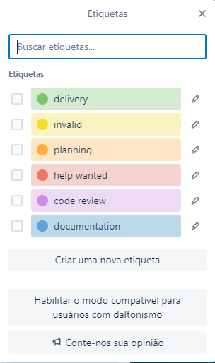

# Metodologia

A metodologia contempla as ferramentas utilizadas pela manutenção dos recursos e demais recursos quanto à organização do tempo e execução das tarefas do projeto. 

## Relação de Ambientes de Trabalho

Os atributos do projeto foram desenvolvidos a partir das plataformas GitHub e Figma, e a relação dos ambientes está apresentada na tabela abaixo. 

| Ambiente | Plataforma | 
--------- | ---------- |  
| Repositório de código fonte | [GitHub](https://github.com/ICEI-PUC-Minas-PMV-ADS/pmv-ads-2022-2-e3-proj-mov-t4-farmafast) |
| Documentos do projeto | [Figma](https://www.figma.com/file/rVLXxMyInok3LcmbIebwC2/Untitled?node-id=0%3A1) |
| Gerenciamento de Projeto | [Trello](https://trello.com/b/XMfxlqCf/quadro-kanban), [Gantt](https://sgapucminasbr-my.sharepoint.com/:x:/g/personal/1349321_sga_pucminas_br/EbLW4-6kP0hDuhLmzo9n_2UBkS2UfUH7uqSUSkS3VEvM9Q?e=emiwkW)  |
| Comunicação e Reuniões | [Teams](https://teams.microsoft.com/_), [Discord](https://discord.com/), [WhatsApp](https://web.whatsapp.com/) |

## Controle de Versão
De acordo com Vietro (2015), é importante observar o uso de técnicas e metodologias para o desenvolvimento de sistemas, buscando melhorar as práticas atuais. Diante disso torna-se essencial o gerenciamento do software, e isso envolve administrar as várias etapas do processo, como, por exemplo: requisitos do sistema, arquitetura do software, padrões de codificação, gerência de configuração, deploy, entre outros.

Pensando nesse contexto, o grupo optou por utilizar um processo fundamentado no GitFlow para a gestão do código fonte do software que será desenvolvido.

O GitFlow é um framework criado em 2010 e considerado um ótimo modelo de branching, além de ser usado para trabalhar em conjunto com o sistema de controle de versão Git (VIETRO, 2015). Assim sendo, as manutenções do código serão efetuadas definindo-se os papéis de cada branch em separado, como eles devem interagir entre si, e com a identificação de Branch Master, Branch Develop, Feature Branch, Release Branch, Maintenance Branch (Hotfix).

Figura 6 - GitFlow Workflow Modelo de Fluxo de Controle do Código Fonte no Repositório Git
 

Fonte: Vietro (2015)

Esse modelo de workflow utiliza dois branches principais para guardar o histórico do projeto, ao invés de trabalhar com apenas um Branch Master. O Branch Master guarda o histórico oficial das entregas, já o Branch Develop serve como integração entre todos os branches de funcionalidades (Feature Branches). Cada funcionalidade deve ter seu próprio branch, e ele deve ser criado a partir do Branch Develop. Quando uma funcionalidade for concluída, ela é mesclada (merged) novamente com o seu branch pai. Quando o Branch Develop estiver com funcionalidades suficientes para uma entrega, criaremos um branch de entrega (Release Branch). Com isso, damos início ao próximo ciclo de entrega, ou seja, nenhuma nova funcionalidade pode ser incluída a partir desse momento. Quando estivermos prontos para realizar a entrega, o Release Branch é mesclada com os branches Master e Develop. O Maintenance Branches (Hotfix) são usados para corrigir rapidamente algum problema em produção. Este é o único branch que deve ser criado a partir do Master. Assim que a correção for finalizada, o branch é fechado e mesclado com o Master e Develop, mantendo assim as linhas completamente atualizadas (VIETRO, 2015).
## Gerenciamento de Projeto
O grupo decidiu por utilizar a metodologia Ágil, sendo escolhido o Scrum como base para definição do processo de desenvolvimento do projeto.
### Divisão de Papéis
Apresente a divisão de papéis entre os membros do grupo.
A organização da equipe está apresentada conforme abaixo:

a) Scrum Master:
Vitória Gabriella Maffei Corrêa Rocha

b) Product Owner: 
Mateus Curcino De Lima

c) Equipe de Desenvolvimento

• Vitória Gabriella Maffei Corrêa Rocha  
• Isabella Carolina De Almeida Siqueira Damião  
• Julia Mendes Lima da Cunha  
• Fábio Furlan  
• Arthur Victor de Paula  

d) Equipe de Design

• Vitória Gabriella Maffei Corrêa Rocha  
• Isabella Carolina De Almeida Siqueira Damião  
• Julia Mendes Lima da Cunha  
• Fábio Furlan  
• Arthur Victor de Paula  

### Processo

Na organização e na distribuição das tarefas do projeto, o grupo utiliza o aplicativo de gerenciamento de projetos denominado Git Projects, onde o mesmo está estruturado com as seguintes listas:

Documentação: sequência das tarefas referentes à documentação de contexto que serão trabalhadas pela equipe, conforme cronograma do curso.

Product Backlog: local onde é adicionado as tarefas a serem trabalhadas pela equipe, assim como as tarefas que forem identificadas no andamento do projeto.

To Do: representa o Sprint Backlog atual que está sendo trabalhado.

In Progress: tarefas que foram iniciadas são adicionadas nessa lista.

Test (CQ - Checagem de Qualidade): lista das tarefas que foram concluídas. Nesse estágio cabe-se ainda uma revisão para verificar a qualidade.

Done: nesta lista são adicionadas as tarefas que passaram pela Checagem de Qualidade e estão prontas para serem enviadas e/ou entregues.

Locked: lista onde será relacionado e especificado o que está impedindo a conclusão da tarefa, juntamente com um comentário sobre o que está travando a tarefa.

O quadro gerenciado pelo grupo no aplicativo Trello está disponível através da URL especificada no Quadro 7 e é apresentado, em seu estado atual, congênere figura abaixo. A caracterização da estrutura montada se fundamentou no artigo escrito por Littlefield (2016), assim como nos conceitos de Scrum de Schwaber e Sutherland (2020).

Fonte: Trello - Elaborado pelos autores

Para visualizá-lo adequadamente torna-se necessário se direcionar para o [Trello](https://trello.com/b/XMfxlqCf/quadro-kanban).

Figura 7 - Tela do Trello para Gerenciamento do Projeto.

### Ferramentas

As ferramentas empregadas no projeto são:

A hospedagem do repositório, definida pela faculdade, será no GitHub, sendo assumido para o controle de versão do projeto, a utilização do Git.

O sistema de controle de versão moderno e mais utilizado é o Git e, com ele, é possível acompanhar as alterações de código realizadas no decorrer da codificação, assim como ser possível reverter para versões anteriores e específicas (Taysser-Ghergal et al, 2022).

No que tange ao gerenciamento das Issues, optamos por adotar no projeto as etiquetas: documentation, delivery, planning, invalid, help wanted e code review.

A tarefas estão etiquetadas em função da natureza da atividade e seguem o esquema de cores/categorias conforme abaixo:

Fonte: Elaborado pelos Autores

## Ferramentas
As ferramentas aplicadas no projeto são:

### Editor de código:

[VSCode](https://code.visualstudio.com/updates/v1_71) e [Expo](https://expo.dev/).
Possuem integração com o Git, sendo possível realizar commits do GitHub para o Visual Studio Code.

### Ferramentas de Comunicação:

WhatsApp, Discord, Microsoft Teams, Trello.

São ferramentas completas e úteis para a gestão da equipe, viabilizando as chamadas de vídeo, de áudio e/ou por chat, seja pelo computador ou pelo smartphone.

### Ferramentas para Criação de Diagramas:

[Lucidchart](https://www.lucidchart.com/pages/pt/landing?utm_source=google&utm_medium=cpc&utm_campaign=_chart_pt_allcountries_mixed_search_brand_exact_&km_CPC_CampaignId=1500131167&km_CPC_AdGroupID=59412157138&km_CPC_Keyword=lucidchart&km_CPC_MatchType=e&km_CPC_ExtensionID=&km_CPC_Network=g&km_CPC_AdPosition=&km_CPC_Creative=294337318298&km_CPC_TargetID=kwd-33511936169&km_CPC_Country=9101004&km_CPC_Device=c&km_CPC_placement=&km_CPC_target=&gclid=Cj0KCQjw-fmZBhDtARIsAH6H8qhfP7cQILBiBPfE2us4B0YQ6d-SYWJGw75BCX_7OYAxCkHE8q5yHmsaAnVIEALw_wcB).

Possui acesso gratuito e de fácil interação, sendo possível criar diagramas conforme a necessidade do projeto, assim como a edição colaborativa pela equipe.

### Ferramentas de Desenho de Tela (Wireframing):

[Figma](https://www.figma.com/).

Possui acesso gratuito e de fácil interação, sendo possível criar wireframes conforme a necessidade do projeto, assim como a edição colaborativa pela equipe.